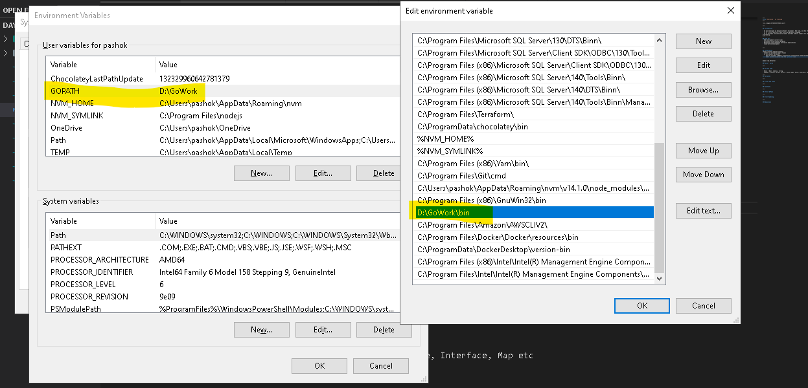

---

## Introduction

- Go was developed at Google by Robert Griesemer, Rob Pike, and Ken Thompson in 2007
- It is a cross-platform, open source programming language
- It is strongly and statically typed, provides inbuilt support for garbage collection, and supports concurrent programming.
---

## Used for:
- Web development (server-side)
- Developing network-based programs
- Developing cross-platform enterprise applications
- Cloud-native development

---

## Installation

- Install in a location apart from C (https://golang.org/doc/install)
- In Environment variables: - Set new variable 'GOPATH': pointing to installation folder/workspace folder
- Under system variables: Add the 'gofolder'\bin 

---
## Alternatively use online go playground
https://go.dev/play/
---
## Hello - world

---

## Go Data type

- Basic - Bool, numeric, string
- Complex - Pointer, Array, Struct, Union types, Slice, Interface, Map etc

---
## Variables

---

## Arrays and Loops

---

## Functions

---

## Struct & Maps

---

## Error Handling

---

### Questions

---

### Questions
---
# Assignment - 1
Create a go program which does the following:
  - Create a functions where function 1 accepts 2 numbers returns a number as it's division
  - Print these values using fmt package
  - Implement simple error handling if error is thrown while division print the error
---
# Assignment - 2
Create a go program which does the following:
  - Create a function which accepts an array
  - print only odd indexed elements in the array.
  - example if array has {"apple", "orange", "grapes","pineapple"}, it should print: 
  orange  
  pineapple

